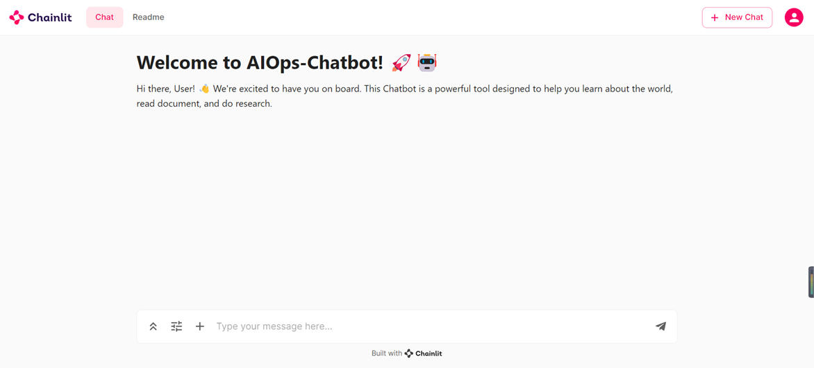

# TINYROBOTBENCH

***LLM Guides Robot Operations***

- [Motivation](#motivation)
- [Introduce](#introduce)
- [Install](#install)
- [Get Start](#get-start)
- [On Doing Checklist](#on-doing-checklist)


<br>

## Motivation
I am an undergraduate student keen pursue Robotics/Embodied AI research in the future. As such, Simulation Environment and LLM are essential tools I need to engage with (I'm looking forward to directly play with hardware one day).

So, as a practice and leisure activity, I replicated [TYNYROBOTBENCH](https://zhuanlan.zhihu.com/p/667452905), thanks to [@东林钟声](https://www.zhihu.com/people/dong-lin-zhong-sheng-76).

Although this project is quite toy 😂, I find it helpful for a beginner like me.

Perhaps in the future, more LLM and Manipulation/Navigation Tasks can be integrated into this project to make it more practically valuable, just similar to ```pytracking```/```maniskill```? I'm not sure...if it's meaningful...

<br>

## Introduce
**TINYROBOTBENCH** is currently a demo of LLM guiding robotics tasks, with the following main features:

- A basic set of robotic manipulation APIs (based on ```Sapien```)
- A tool for deploying LLM and publishing LLM APIs (based on ```HF transformers``)
- A ChatBot Web UI (based on ```chainlit``` & ```langchain```, supporting RAG & Multi-Modal. But it doesn't seem very useful yet for this project...)

The video bellow display the function of this project (Web UI not shown yet as it's unnecessary):

<video src="./.video/demo.mp4" controls="controls"></video>

The Web UI is as follows, you can upload images or files, just like ChatGPT-Plus:


A more detailed introduction to this project is:

LLM has considerable application prospects in the field of Robotics/Embodied AI. Microsoft's [PromptCraft](https://www.microsoft.com/en-us/research/uploads/prod/2023/02/ChatGPT___Robotics.pdf) demonstrates how GPT can provide robot operation codes. The specific process is as follows:

1. Maintain a high-level robot API, mainly including perception (locating and identifying objects), control (moving, grasping), etc.
2. Construct a Prompt for the LLM, describe the goal, and specify the currently available robot operation API.
3. Users evaluate the code generated by ChatGPT, then provide feedback to ChatGPT (Good dog! 🐶
😋 / Bad dog! 🐶😅).
4. Apply the code generated by ChatGPT to the robot.

This project currently uses a simple grasping task demo to go through the entire above process. However, the task is very toy. For example, even the location acquisition is implemented directly through system APIs rather than perception schemes like object detection. <br>I should be able to improve it later.

### 🔥 If you have any needs or good suggestions, feel free to contact me!

<br>

## Install

When I run this project myself, I just upload the llm_server folder tp a headless remote server (with an Nvidia GPU), and place the manipulate folder on my local computer.

On the remote server, just run the command:
```
chmod +x path_to_llm_server/install.sh
./path_to_llm_server/install.sh
```

On the local machine, run the command:
```
chmod +x manipulate/install.sh
./manipulation/install.sh
```

<br>

## Get Start

Now assuming you have already upload the llm_server folder to the remote server and place the manipulate folder locally, and installed the dependencies.

- Configure LLM
1. Download a LLM from Hugging Face and upload it to the remote server, for example, ```llava-v1.6-vicuna-7b```
2. Add the folder path of ```llava-v1.6-vicuna-7b``` to the ```llm_model_dict["llava-v1.6-vicuna-7b"]["local_model_path"]``` in ```path_to_llm_server/config/model_config.py``` 
3. **Optional**: Change the ```model_port``` value in ```path_to_llm_server/config/network_config.py``` to select a server port where you want to publish the LLM API. The default port is 6006.
4. Run the command ```python path_to_llm_server\llm\server.py llava-v1.6-vicuna-7b``` to publish the LLM API!
5. **Optional**: Run the command ```chainlit run path_to_llm_server\web_ui\chainlit_chat.py --port port``` to open the ChatBot Web UI, but it is not neccessary for this demo of LLM guiding robot operations.

- Configure Robot
1. Replace the the ```url``` variable in the ```path_to_manipulate/request_llm_server.py``` with the URL published by the server, for example, ```https://u102232-8229-b10afc7e.westb.seetacloud.com:8443/```
2. Run the command ```python path_to_manipulate/request_llm_server.py query```, where ```query``` is the command you want to feed to the LLM, for example:
    ```
    python ath_to_manipulate/request_llm_server.py You are now a module responsible for generating planning code for robots. Below are the APIs you can directly call:\
    1. get_location_by_name(name): Retrieves the xyz position of the object corresponding to the input name, used to locate the object.\
    2. move_tool(xyz): Moves the end effector to the xyz position.\
    3. grasp(): The end effector performs a grasp, able to grab objects near the current robot's gripper.\
    4. ungrasp(): Releases the grasp of the end effector, and the gripped object will be dropped at the current position.\
    5. get_names_on_table(): Returns a list type, returning the names of all objects on the table.\
    6. get_box_postion(): Returns the xyz position of a box where objects can be temporarily stored.\
    Please implement the plan() function in Python based on the above APIs, moving all objects on the table to the target position. Only the code output is needed, no other descriptions are required.
    ```
    The standard answer should be as follows, and apart from the code (or comments), there should be no other description:
    ```
    def plan():
        box_position = get_box_position()
        object_names = get_names_on_table()
        for name in object_names:
            object_position = get_location_by_name(name)
            move_tool(object_position)
            grasp()
            move_tool(box_position)
            ungrasp()
    ```
    - In fact, the APIs currently supported by this project are just the above six types.
3. **Optional**: If you want to feed an image to LLM, just add the argument ```--image_path image_path```
4. **Notice**: Some LLMs may perform too poorly to output executable valid codes. So, if you merely want to see the robot perform task demo, you can comment out the following statement in ```path_to_manipulate/request_llm_server.py```:
    ```
    response = requests.post(url, headers=headers, data=json_data)
    if response.status_code == 200:
        print("Request successful!")
        llm_generated_func  = json.loads(response.text)["response"]
        print("Response:\n", llm_generated_func )
    else:
        print("Request failed with status code:", response.status_code)
    ```
    Then uncomment the following statement:
    ```
    # llm_generated_func = \
    # """def plan():
    #     box_position = get_box_position()
    #     object_names = get_names_on_table()
    #     for name in object_names:
    #         object_position = get_location_by_name(name)
    #         move_tool(object_position)
    #         grasp()
    #         move_tool(box_position)
    #         ungrasp()"""
    ```
    Then normally run the command```python path_to_manipulate/request_llm_server.py query```

- Then you can see the Robot performing task

<br>

## On Doing Checklist

### 🔥 Want to make an academic Benchmark for LLM guiding robot operations ...